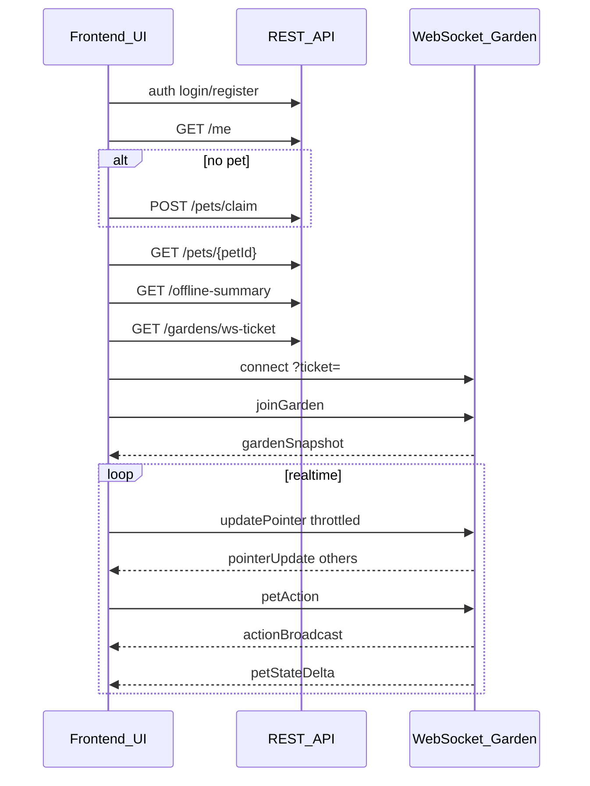

# 前端开发任务与对接说明（cute_cat）

本文档面向**前端开发**，在 [切片0-2工程骨架.md](切片0-2工程骨架.md)、[开发周期计划.md](开发周期计划.md) 与 [API-后端与前端对接.md](API-后端与前端对接.md) 基础上，固定**本阶段任务拆分、验收方式与待确认项**。字段级协议以 [API-后端与前端对接.md](API-后端与前端对接.md) 为准，本文不重复全部 JSON，只列集成要点。

---

## 1. 文档目的

- 让前端按**用户旅程**串联 HTTP + WebSocket，完成周期 0（工程骨架）与周期 1（切片 0+2）可演示闭环。
- 标明 **UI 参考稿与规范**（见 §10、[UI设计-规范与稿清单.md](UI设计-规范与稿清单.md)），避免视觉与交互拍脑袋。
- 列出与后端已对齐的**实现细节**（当前仓库 `backend/`），减少联调返工。

---

## 2. 当前阶段范围

| 阶段 | 目标 |
|------|------|
| **周期 0** | 初始化 `frontend/`：`Vite + TypeScript` + `Phaser 3`；HTML/CSS 叠层容器可显示；可请求后端健康检查。 |
| **周期 1（切片 0 + 2）** | 连续游戏时间表现（来自服务端快照/增量）；离线摘要面板；WebSocket `joinGarden` → 渲染快照；`updatePointer` 节流；`Feed` / `Cuddle` / `Pat` → `petStateDelta` + `actionBroadcast`；双客户端同花园可感知同步。 |

### 2.1 本迭代明确不做（避免范围蔓延）

- 商店/医院完整扣费与库存、`TreatAtHospital` 完整链路（周期 2）。
- `eventBroadcast` 的业务 UI（周期 3；消息可忽略或仅占位日志）。
- LangChain 文案与记忆展示（周期 4）。
- 生产级部署与监控（周期 5）。

### 2.2 验收清单（对齐切片骨架 §4 + 周期 1）

1. **切片 0（离线不暂停）**  
   - 离开一段时间后再进入：状态与游戏时间一致推进（以服务端 `GET /pets/{petId}` / `gardenSnapshot` / `petStateDelta` 为准）。  
   - 进入游戏流程后展示 **离线摘要**（`GET /offline-summary`），原因与建议动作可读。

2. **切片 2（多人同步）**  
   - 两个浏览器会话（两用户）在同一花园：任一方操作，另一方在约 **0.5～1 秒**内看到 **指针变化** 或 **状态条/动画** 至少一种。

3. **策略可感知（MVP）**  
   - 按摘要建议的「喂食」等操作，与随意点击相比，状态变化方向可感知（不必严格数值平衡，但需与后端规则一致）。

---

## 3. 技术栈与工程约束

| 项 | 约定 |
|----|------|
| 构建 | `Vite` + `TypeScript` |
| 画布 | `Phaser 3`；花园场景、占位精灵、他人指针 |
| UI | **HTML/CSS 叠层**（状态条、按钮、弹窗、Toast），不放在 Phaser 内做复杂 DOM |
| 网络 | `fetch` 或轻量 HTTP 客户端；原生 `WebSocket` 或薄封装 |

### 3.1 建议目录结构（与 [项目目录说明.md](项目目录说明.md) 一致）

```
frontend/src/
  pages/        # 页面/容器：花园、登录注册等
  components/   # 进度条、按钮、弹窗、Toast
  game/         # Phaser 场景、坐标映射、图层
  state/        # 客户端缓存：宠物状态、用户、连接状态
  network/      # HTTP 客户端、WebSocket 收发与消息类型
```

---

## 4. 环境与联调

| 项 | 说明 |
|----|------|
| 后端 Base URL | 开发默认 `http://localhost:8000`；REST 前缀为 **`/api/v1`**（与后端 `Settings.api_prefix` 一致）。 |
| 前端开发端口 | Vite 默认 `http://localhost:5173`；后端 CORS 默认允许 `http://localhost:5173`（环境变量 `CORS_ORIGINS`，逗号分隔多 origin）。 |
| 根目录 `.env` | 联调相关：`PUBLIC_BASE_URL`（用于生成 ws URL 等，见 [API-后端与前端对接.md](API-后端与前端对接.md) §12）。前端侧建议单独使用 `VITE_*` 或文档约定，**仅指向**可公开的后端地址，勿提交密钥。 |

**CORS**：后端已启用 `CORSMiddleware`；本地若更换前端端口，需在服务端 `CORS_ORIGINS` 中追加。也可使用 Vite `server.proxy` 将 `/api` 代理到后端，此时需注意 WebSocket 是否需独立代理（依 Vite 配置而定）。

---

## 5. Token 与鉴权（建议）

- **Access token**：内存保存；请求头 `Authorization: Bearer <accessToken>`。  
- **Refresh token**：SPA 常见做法为 `localStorage`（实现简单）或 **httpOnly Cookie**（更安全，需后端配合）。当前 MVP 可与产品约定：**localStorage + HTTPS 生产环境**，避免在文档中写死，团队选一句即可。  
- **401**：access 过期时，用 refresh 换新的 access（`POST /api/v1/auth/refresh`），失败则回登录页。  
- **WebSocket**：使用 **query ticket**（见下文），**不要**与 Bearer 混用两套方案。

---

## 6. HTTP：用户旅程与任务清单

建议顺序（与联调、验收一致）：

| 步骤 | 方法 | 路径 | 任务要点 |
|------|------|------|----------|
| 1 | `POST` | `/api/v1/auth/register` 或 `login` | 保存 `accessToken` / `refreshToken` |
| 2 | `GET` | `/api/v1/me` | 判断 `petId`、`gardenId` 是否为空 |
| 3 | `POST` | `/api/v1/pets/claim` | 仅未领宠时；body 含 `petName`、`petType`（枚举见对接文档） |
| 4 | `GET` | `/api/v1/pets/{petId}` | 进入花园前 hydrate：状态条、成长、游戏时间等 |
| 5 | `GET` | `/api/v1/offline-summary?petId=` | 驱动 **离线摘要** 弹窗；`reasons`、`suggestedActionType` |
| 6 | `GET` | `/api/v1/gardens/ws-ticket` | 取 `wsUrl`、`ticket`、`expiresIn`；拼接 WebSocket |

错误体格式见 [API-后端与前端对接.md](API-后端与前端对接.md) §1.3。

---

## 7. WebSocket：任务清单

| 项 | 说明 |
|----|------|
| URL | `wsUrl` + `?ticket=<ticket>`（与 `GET /gardens/ws-ticket` 返回一致；实现为 `/api/v1/ws/garden?ticket=`） |
| 消息外层 | `{ "type", "requestId", "payload" }`；**每条客户端消息建议带 `requestId`** |
| 发送 `joinGarden` | `payload.gardenId` 必须与 ticket 内花园一致，否则收到 `error` |
| 发送 `updatePointer` | 需**先**成功 `joinGarden` 并进入房间；节流 **约 100ms** |
| 发送 `petAction` | `actionType`：`Feed` \| `Cuddle` \| `Pat`；`petId`；`Feed` 时 `itemId` 必填（先经 `/shop/buy` 入库） |
| 订阅 `gardenSnapshot` | 首次进入后全量；渲染宠物列表、用户指针、游戏时间 |
| 订阅 `pointerUpdate` | **仅他人**（后端当前实现：不广播给自己） |
| 订阅 `actionBroadcast` | **房间内所有人**（含操作者本人） |
| 订阅 `petStateDelta` | **房间内所有人**；用 `stats` 覆盖 UI，`delta` 可做 Toast 或动画 |
| 订阅 `error` | 与 `requestId` 对齐 |

### 7.1 断线重连（建议）

- 连接关闭后：**重新请求** `GET /gardens/ws-ticket`，再 `joinGarden`。  
- 不要在长连接上复用过期 ticket。

### 7.2 动作与动画去重（重要）

当前后端对 `petAction` 会向 **所有连接**（含自己）发送 `actionBroadcast` 与 `petStateDelta`。  
前端若本地点击时已播放动画，需避免与 `actionBroadcast` **重复播放**（例如：自己操作以本地反馈为准，仅他人 `actorUserId` 走 `actionBroadcast` 动画；或统一只信服务端广播）。

---

## 8. 渲染分工与坐标约定

| 层级 | 职责 |
|------|------|
| Phaser | 花园背景、宠物占位、**他人**指针（由 `pointerUpdate` 驱动） |
| HTML 叠层 | 饥饿/健康/情绪等状态条、金币占位、三动作按钮、离线摘要、Toast |

**坐标**（与当前后端实现一致）：

- 宠物 `position` 与指针 `pointer` 的 `x`/`y` 为 **归一化 0～1**（相对场景或布局）。  
- `layoutVersion` 预留；若未来布局变更，前后端需同步约定。

本地指针：用鼠标在画布上计算归一化坐标，再 `updatePointer` 发出。

---

## 9. 可拆分工单（模块级）

| 模块 | 内容 |
|------|------|
| `network/httpClient` | 封装 baseURL、Bearer、401 refresh、错误体解析 |
| `network/wsClient` | 连接、消息序列化、心跳（如需）、重连与 ticket 刷新 |
| `state/gameStore` | 当前用户、`petId`、`gardenId`、宠物 `stats`、连接状态 |
| `game/GardenScene` | Phaser 场景、归一化坐标→画布、他人指针渲染 |
| `components/OfflineSummaryModal` | 对接 `offline-summary` |
| `components/ActionBar` | 三按钮 → `petAction` |
| `components/StatusBars` | 对接 `stats` / `petStateDelta` |
| `components/ActionToast` | 参考 `ui_action_result_toast`；可结合 `delta` |

---

## 9A. 视觉整合冲刺（按文件路径派工）

> 目标：在不改后端协议的前提下，将当前“功能占位画面”升级为与 UI 稿一致的可演示版本。建议 1 个小迭代（3-5 天）。

### 9A.1 改动范围（仅前端）

- `frontend/src/main.ts`
- `frontend/src/game/GardenScene.ts`
- `frontend/src/styles/tokens.css`
- `frontend/src/styles/app.css`
- 可选：`frontend/src/assets/`（场景/宠物资源）
- 可选：`frontend/src/ui/`（组件拆分）

### 9A.2 任务单（可直接指派）

| 任务 | 目标 | 主要文件 | 验收口径 |
|------|------|----------|----------|
| T1 场景与宠物替换（P0） | 替换纯色背景与圆点宠物，占位升级为场景图 + 宠物精灵 | `game/GardenScene.ts` | 不再出现纯底色 + 圆点；保留 `setPetNormPosition` 与 pointer 同步 |
| T2 HUD 与按钮样式（P0） | 状态条、动作按钮、面板边框按设计 token 统一 | `styles/tokens.css`、`styles/app.css` | 与 `ui_garden_main` 风格一致，含 hover/disabled/loading |
| T3 认证与领宠页还原（P0） | 登录/注册/领宠及错误态按 UI 稿落地 | `main.ts`、`styles/app.css` | 对齐 `ui_auth_*`、`ui_pet_claim*`，错误提示可视化 |
| T4 离线摘要与 Toast（P0） | 弹层与反馈条按 UI 稿实现 | `main.ts`、`styles/app.css` | 对齐 `ui_offline_summary`、`ui_action_result_toast` |
| T5 连接态顶栏（P1） | `connecting/connected/reconnecting/disconnected` 可见 | `main.ts`、`styles/app.css` | 对齐 `ui_ws_*`，断线不静默 |
| T6 主文件拆分（P1） | 降低 `main.ts` 复杂度，便于后续迭代 | `main.ts` + 可选 `src/ui/*` | 认证、领宠、HUD、弹层拆成独立模块 |

### 9A.3 执行顺序（建议）

1. D1-D2：T1 + T2（先完成主画面）
2. D2-D3：T3 + T4（账号与弹层）
3. D3：T5 + 双端联调回归
4. D4（可选）：T6（模块拆分）

### 9A.4 联调回归（不回退）

- 注册 → 领宠 → 进花园链路正常
- `GET /gardens/ws-ticket`、`joinGarden` 正常
- `petAction` → `petStateDelta` 正常
- 双客户端可见指针/状态同步

---

## 10. UI 资源对照与规范（指派开发前请核对）

**状态**：UI 组已确认 **主仓库 `assets/ui/` 与 [UI设计-规范与稿清单.md](UI设计-规范与稿清单.md) §3 / §3.1 一致**，共 **16** 个 `ui_*.png`（此前未入库的花园主界面、离线摘要、Toast、成长、商店/医院、生日等已补全；对齐说明见 [开发进度日志.md](开发进度日志.md) 2026-03-22）。**实现 token 与字段对照以规范文档 §2、§4 为准**。  
仍待产品拍板：**移动端**是否纳入周期 1（规范文档 §1：周期 1 默认桌面；若做移动需单独 UI 稿）。

### 10.1 仓库参考图（命名约定：`assets/ui/ui_*.png`）

若本地未同步二进制，以设计稿仓库或 Figma 为准。

| 文件 | 用途 | 周期 1 优先级 |
|------|------|----------------|
| `ui_garden_main.png` | 花园主界面、HUD、动作按钮、他人指针 | **高** |
| `ui_offline_summary.png` | 离线摘要弹窗 | **高** |
| `ui_action_result_toast.png` | 动作反馈条 | 建议 |
| `ui_pet_status_growth.png` | 成长与稳定度面板 | 可简化：仅显示数值条 |
| `ui_shop_hospital.png` | 商店/医院 | 周期 2+ |
| `ui_birthday_event.png` | 生日活动 | 周期 3+ |
| `ui_design_system_components.png` | 设计系统（色板、组件、间距） | 建议 |
| `ui_auth_login.png` / `ui_auth_register.png` | 登录、注册 | **高** |
| `ui_auth_login_register.png` | 登录/注册 Tab 同屏（可选） | 可选 |
| `ui_auth_error_states.png` | 认证错误态（401、422 等） | **高** |
| `ui_pet_claim.png` | 领宠：起名、`petType` 选择 | **高** |
| `ui_pet_claim_conflict.png` | 已领宠冲突提示 | 建议 |
| `ui_ws_connecting.png` / `ui_ws_disconnected.png` / `ui_ws_reconnecting.png` | WebSocket 连接态顶栏 | 建议 |

### 10.2 原「缺口」覆盖情况（按规范稿实施）

| 原缺口项 | 现对照 |
|----------|--------|
| 登录 / 注册 / 错误态 | `ui_auth_login.png`、`ui_auth_register.png`、`ui_auth_error_states.png`；可选 `ui_auth_login_register.png` |
| 领宠 | `ui_pet_claim.png`、`ui_pet_claim_conflict.png`（`petType` 与 API 枚举一致） |
| 全局设计规范 | `ui_design_system_components.png` + [UI设计-规范与稿清单.md](UI设计-规范与稿清单.md) §2 |
| 连接态 | `ui_ws_*.png`（顶栏非全屏阻断） |
| 移动端 | **未纳入**周期 1 默认范围；若产品要求，再向 UI 组要独立稿 |

### 10.3 开工前自检（前端 / 技术负责人）

1. 对照 [UI设计-规范与稿清单.md](UI设计-规范与稿清单.md) **§3.1**（**16** 个文件名列表）与本地 **`assets/ui/`** 逐项勾选；若某克隆/分支仍缺文件，须合并主分支或导入完整资源后再开发主界面。  
2. **提交 / 合并 PR 时** 确保 **16 个 PNG 一并进入版本库**，避免再次出现「部分同步」。  
3. **Figma / 可编辑源**：仍为设计协作项——规范 §1 约定「链接空缺时以仓库 PNG 为准」；设计组填入真实 URL 后更利于切图与走查。  
4. **非 UI 阻塞**：与产品 / 技术确认 **§11**（refresh 与 `localStorage`、生产 HTTPS、多标签页同账号等）；无结论可先按文档默认实现并在 PR 说明。

---

## 11. 待确认项（与后端/产品一次对齐）

以下 **不由 UI 稿解决**；与 [开发进度日志.md](开发进度日志.md) 2026-03-22「非 UI 阻塞」一致。

| 项 | 说明 |
|----|------|
| Refresh 存储 | `localStorage` 是否接受；生产是否 HTTPS |
| 前端 `VITE_API_BASE` 等命名 | 与 `.env.example` 一致即可 |
| 多标签页 | 是否同开多页同账号（可能影响 WS 与状态） |
| 移动端（周期 1） | 默认仅桌面；若产品要求移动端，需另排 UI 稿，不在此前「主仓库 16 稿」默认范围 |

以下已在当前后端实现中**有明确行为**，无需再猜：

| 项 | 结论 |
|----|------|
| 路径前缀 | `/api/v1` |
| `pointerUpdate` | 仅他人 |
| `actionBroadcast` / `petStateDelta` | 含操作者本人 |
| 坐标 | 归一化 0～1 |

---

## 12. 联调顺序与双客户端验收步骤

### 12.1 推荐联调顺序

1. 后端启动：`uvicorn` + 数据库迁移完成（见 `backend/README.md`）。  
2. 前端 `GET /health` 或 `/api/v1/health`。  
3. 单用户 `register` → `claim` → `pets` → `offline-summary` → `ws-ticket` → WS `joinGarden`，确认 `gardenSnapshot`。  
4. 单用户 `updatePointer`、`petAction`，确认 `petStateDelta` 与 UI 一致。  
5. 第二用户注册并领宠到**同一花园**（或后端测试数据保证同 `gardenId`），双开浏览器联调。

### 12.2 双客户端验收（周期 1）

1. 用户 A、B 均进入同一花园（WS 均 `joinGarden` 成功）。  
2. A 移动鼠标：B 应在 **1 秒内**看到 A 的指针更新（或等价表现）。  
3. A 对宠物执行 `Feed`/`Cuddle`/`Pat`：B 看到 **状态变化** 或 **动画/Toast** 至少一种。  
4. B 离线再进入：弹出离线摘要，且与 `GET /pets` 状态一致。

### 12.3 周期 2 成长面板最小联调步骤（新增）

> 目标：完成“前端成长面板与后端字段一致”的逐项验证。字段口径以 [API-后端与前端对接.md](API-后端与前端对接.md) §14 为准。

1. 启动后端与前端，确保后端已执行最新迁移（`alembic upgrade head`）。
2. 登录并进入花园后，调用一次 `GET /api/v1/pets/{petId}`，记录基线值：
   - `stats.health`
   - `stats.mood`
   - `growthStage`
   - `stability.stabilityScore`
   - `stability.consecutiveStableDays`
   - `stability.lastGameDayIndex`
3. 执行动作链路并对照：
   - 动作 A：`Cuddle`（不依赖库存）
   - 动作 B：`Feed`（先 `POST /shop/buy` 购买后带 `itemId`）
   - 每次动作后核对 `petStateDelta.payload.stats` 与面板最终显示一致
4. 完成至少两组“前后截图 + 字段对照结论”并写入 `doc/开发进度日志.md`。

---

## 13. 集成序列（参考）



---

## 14. 相关文档索引

- 产品规则：[项目设计文档.md](项目设计文档.md)  
- 协议全文：[API-后端与前端对接.md](API-后端与前端对接.md)  
- 切片模块与算法口径：[切片0-2工程骨架.md](切片0-2工程骨架.md)  
- 迭代路线：[开发周期计划.md](开发周期计划.md)  
- 目录约定：[项目目录说明.md](项目目录说明.md)  
- UI 规范与稿清单：[UI设计-规范与稿清单.md](UI设计-规范与稿清单.md)（§3.1 为 16 文件勾选依据）  
- 进度与对齐记录：[开发进度日志.md](开发进度日志.md)  
- 后端运行：[README.md](../README.md)、[backend/README.md](../backend/README.md)

---

## 15. 测试交付说明模板（周期 2 收口）

> 用途：测试组接收前端交付后，可直接按本模板执行并回填；完成后可支撑将周期 2 验收矩阵对应项从 `IN_PROGRESS` 改为 `DONE`。

### 15.1 交付版本信息（由开发填写）

- 分支/提交：
- 交付日期：
- 本次范围：
  - [ ] 商店购买（`/shop/buy`）
  - [ ] 库存面板（`/shop/inventory` hydrate）
  - [ ] 库存喂食（`Feed` 必传 `itemId`）
  - [ ] 医院治疗（`/hospital/treat`）
  - [ ] 成长字段展示（`growthStage`、`stabilityScore`、`consecutiveStableDays`、`lastGameDayIndex`、`sickCountInWindow`、`windowGameDays`）

### 15.2 测试前置（由测试确认）

- [ ] 后端已启动并可访问 `GET /api/v1/health`
- [ ] 前端已启动并可访问页面
- [ ] 数据库迁移已执行（`alembic upgrade head`）
- [ ] 测试账号具备可进入花园的宠物（或可完成注册/领宠）

### 15.3 自动化与构建回归

- [ ] `cd backend && pytest -q` 通过（记录结果：）
- [ ] `cd frontend && npm run build` 通过（记录结果：）
- [ ] `cd frontend && node scripts/capture-screenshots.mjs` 通过（记录结果：）
  - `wsJoinPassed=`
  - `actionDeltaPassed=`
  - `usedOfflineModalForFourthShot=`

### 15.4 手工验收步骤（字段逐项对照）

1. 登录并进入花园，记录 `GET /api/v1/pets/{petId}` 基线（S0）。
2. 在商店购买一种食物（建议 `food_basic_01`），确认：
   - [ ] 返回 `inventoryCount` 增加
   - [ ] 库存面板对应道具数量更新
3. 从库存下拉框选择道具并执行 `Feed`，确认：
   - [ ] 请求带 `itemId`
   - [ ] 触发 `petStateDelta`
   - [ ] 面板最终与 `petStateDelta.payload.stats` 一致
4. 执行医院治疗，确认：
   - [ ] `/hospital/treat` 成功返回
   - [ ] `stats.sickLevel` 按预期变化
   - [ ] 前端状态条与返回 `stats` 最终一致
5. 成长字段对照（S1）：
   - [ ] `growthStage`
   - [ ] `stabilityScore`
   - [ ] `consecutiveStableDays`
   - [ ] `lastGameDayIndex`
   - [ ] `sickCountInWindow`
   - [ ] `windowGameDays`
   - [ ] 与 `GET /api/v1/pets/{petId}` 最终一致

### 15.5 证据留存（必须）

- 截图路径（至少两组前后变化）：
  - 前：
  - 后：
- 关键接口响应摘录（可贴 JSON 片段）：
  - `/shop/buy`：
  - `/shop/inventory`：
  - `/hospital/treat`：
  - `petStateDelta`：
- 测试结论：
  - [ ] 通过（可推进周期 2 DONE）
  - [ ] 不通过（需回归修复）
  - 问题描述与复现步骤：

### 15.6 回填到日志（测试完成后）

- 将本模板执行结果摘要写入 `doc/开发进度日志.md` 最新小节，至少包含：
  1. 命令结果（pytest/build/脚本）
  2. 字段对照结论（逐项一致/不一致）
  3. 证据路径（截图与关键响应）
  4. 下一步唯一动作（DONE 或修复项）

---

## 16. 一页式测试执行单（可直接抄用）

> 目标：30-60 分钟内完成周期 2 前端收口验收，输出“可交付/不可交付”结论。

### A. 启动与连通（5 分钟）

- [ ] 后端健康：`GET /api/v1/health` 返回 `{"status":"ok"}`
- [ ] 前端页面可打开并完成登录
- [ ] 能进入花园（`joinGarden` 成功）

### B. 自动化快速回归（10 分钟）

- [ ] `cd backend && pytest -q`（结果：________）
- [ ] `cd frontend && npm run build`（结果：________）
- [ ] `cd frontend && node scripts/capture-screenshots.mjs`（结果：________）
  - [ ] `wsJoinPassed=true`
  - [ ] `actionDeltaPassed=true`

### C. 周期 2 关键链路（15-25 分钟）

- [ ] 商店购买：`POST /shop/buy` 成功，`inventoryCount` 增加
- [ ] 库存读取：`GET /shop/inventory` 返回购买后库存
- [ ] 库存喂食：`Feed` 携带 `itemId`，喂食后库存减少
- [ ] 医院治疗：`POST /hospital/treat` 成功，状态按返回值更新

### D. 成长字段一致性（10-15 分钟）

对照 `GET /pets/{petId}` / `petStateDelta` 与前端面板：

- [ ] `growthStage`
- [ ] `stabilityScore`
- [ ] `consecutiveStableDays`
- [ ] `lastGameDayIndex`
- [ ] `sickCountInWindow`
- [ ] `windowGameDays`

判定：

- [ ] 最终一致（允许瞬时延迟）
- [ ] 存在不一致（需提单）

### E. 证据与结论（5 分钟）

- 截图路径（前后对照各 1 组）：
  - 前：________
  - 后：________
- 关键响应片段：
  - `/shop/buy`：________
  - `/shop/inventory`：________
  - `/hospital/treat`：________
- 最终结论：
  - [ ] 可交付测试通过（建议将周期 2 对应项置为 `DONE`）
  - [ ] 不通过（问题单：________）
