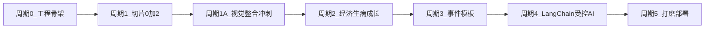

# cute_cat 分周期开发计划

本文档为项目从「设计完成」到「可上线 MVP」的迭代路线图，与 [切片0-2工程骨架.md](切片0-2工程骨架.md)、[项目设计文档.md](项目设计文档.md) 一致。

## 周期划分原则

- 每个周期结束都有**可演示、可验收**的产出（避免堆代码不可玩）。
- 协议与服务器权威优先：先固定 WebSocket 消息类型，再扩展功能。
- 文档联动：每周期结束按 [AGENTS.md](../AGENTS.md) 的 Daily Close Protocol 更新 [开发进度日志.md](开发进度日志.md)；有行为或技术栈变更则同步 [项目设计文档.md](项目设计文档.md)、[README.md](../README.md)、[项目目录说明.md](项目目录说明.md)。

## 周期门禁（防复发，必须执行）

每个周期在宣告“完成”前，必须全部满足下列门禁，避免再次出现“口径漂移/证据不足/风险悬空”：

1. 口径一致门禁
 - `README.md` 的 "Current Phase Card"、`AGENTS.md` 阶段描述、`doc/开发进度日志.md` 最新小节三者一致。
2. 证据留痕门禁
 - 至少有 1 份可追溯证据写入日志：构建结果、测试结果、自动脚本结果或人工走查结论。
3. 风险落地门禁
 - 当期已知风险必须写明“解决周期”或“触发条件”；禁止仅记录风险不落地计划。
4. 下一步唯一门禁
 - 日志中必须明确下一周期的第一优先动作（owner + scope），避免进入下一阶段时目标发散。

---

## 团队协作与角色（开发设计阶段起）

项目即将进入**开发设计阶段**，建议按组分工对齐本文档各周期。职责边界如下（可随组织调整）：

| 组别 | 主要职责 | 与周期的关系 |
|------|----------|----------------|
| UI 设计组 | 像素风界面与交互稿、与 `assets/ui/` 参考图对齐、切图与标注、设计规范（字体/间距/状态） | 周期 0–1 起深度参与；周期 3 事件皮肤与素材 |
| 前端组 | `Vite + TS + Phaser`、HTML 叠层、WebSocket 客户端、状态与动画表现 | 周期 0–5 主实施；与 UI 组对接视觉还原 |
| 后端组 | `FastAPI`、游戏权威逻辑、WebSocket 房间、持久化、事件调度 | 周期 0–5 主实施；周期 4 对接 LangChain |
| 测试组 | 用例与验收清单（对齐各周期「验收」）、联调与回归、协议与数值边界测试 | 每周期末介入验收；重点周期 1–2–3 |
| 运维组 | 环境变量与密钥管理、构建与部署、`infra/`、监控与日志、可选数据库迁移 | 周期 0 起提供本地/测试环境；周期 5 主导上线 |

**协作节奏建议**：每周期开始前由产品/技术负责人组织「周期 kickoff」对齐目标与验收；周期结束时按 [开发收尾规范.md](开发收尾规范.md) 更新日志与文档。

---

## 周期 0：工程骨架与仓库结构（1 个迭代）

**目标**：前后端可独立启动、目录符合 [项目目录说明.md](项目目录说明.md) 预期，协议类型有落点。

**主要工作**

- 初始化 `backend/`：`FastAPI` + `uvicorn`，预留 `realtime/`、`game/`、`persistence/`、`ai/`
- 初始化 `frontend/`：`Vite + TypeScript` + `Phaser 3`，HTML 叠层容器（参考 [assets/ui/](../assets/ui/)）
- 可选 `shared/`：消息枚举与 DTO 的双端约定（MVP 可先手写对齐）
- 根目录补充运行说明（或扩写 [README.md](../README.md) 的 Quickstart 占位）

**验收**

- 后端健康检查可访问；前端空白场景 + 叠层 UI 可显示
- 依赖清单可复现（`requirements.txt` / `pyproject.toml` 与 `package.json`）

---

## 周期 1：切片 0 + 2（核心可玩最小闭环）

**目标**：连续游戏时间 + 离线摘要 + 同花园 WebSocket + `Feed` / `Cuddle` / `Pat` 与状态 delta 广播。

**对齐文档**：[切片0-2工程骨架.md](切片0-2工程骨架.md)、[项目设计文档.md](项目设计文档.md)

**主要工作**

- 后端：`game/time`（墙钟换算 `GameDay`）、`game/offline`（规则化摘要）、`realtime/garden_ws`（房间广播）、`game/actions`（三动作）、`petStateDelta` / `actionBroadcast`
- 前端：`joinGarden` → 渲染快照；`updatePointer` 节流；动作按钮 → `petAction`；状态条与 Toast 反馈
- UI：离线摘要面板（`ui_offline_summary.png`）

**验收**

- 双客户端同花园：一方动作，另一方在约 1 秒内可见指针或状态/动画反馈之一
- 离线后回归：出现离线摘要且建议动作与状态变化一致（规则化即可）

---

## 周期 1A：视觉整合冲刺（功能不回退）

**目标**：在不改后端协议的前提下，将周期 1 的“可玩占位 UI”升级为与 `assets/ui/` 参考稿一致的可演示版本，并固定后续周期复用的前端视觉基线。

**对齐文档**：[前端开发任务与对接.md](前端开发任务与对接.md) §9A、[UI设计-规范与稿清单.md](UI设计-规范与稿清单.md)

**主要工作**

- 前端：完成主画面与 HUD 样式统一（`tokens.css`、`app.css`），保持 `joinGarden -> petAction -> petStateDelta` 链路不变
- 前端：登录/注册/领宠、离线摘要、动作 Toast、连接态顶栏按参考稿还原
- 前端：必要时拆分 `main.ts` 到 `src/ui/*`，降低后续周期迭代成本
- 走查：以 `assets/ui/` 及截图基线为准，确认关键状态（loading/error/disconnected）均可视化

**验收**

- 视觉：不再出现“纯色底 + 圆点宠物”占位主界面，核心页面风格与 `ui_garden_main`、`ui_auth_*`、`ui_offline_summary` 一致
- 行为：周期 1 全部链路无回退（注册/领宠/进花园、`ws-ticket`、`joinGarden`、`petAction`、`petStateDelta`、双端同步）
- 质量：至少一轮前端自测截图与回归记录可追溯（见 [开发进度日志.md](开发进度日志.md)）

---

## 周期 2：经济、生病、医院与成长阶段落地

**目标**：商店/医院/饮食骤变/成长稳定度完整接到权威逻辑。

**对齐文档**：[项目设计文档.md](项目设计文档.md) 经济系统、生病与治疗、`stabilityScore` 与 `growthStage`。

**主要工作**

- 持久化：`User`/`Pet`/`Inventory` 最小表结构；MySQL 读写（见 [后端开发设计文档.md](后端开发设计文档.md)）
- `Feed` 绑定道具与 `dietHistory`；医院治疗扣费与 `sick` 缓解
- `GameDay` tick 或按需回算：饥饿/健康/情绪/`sick` 判定
- 成长：滑动窗口 N=4、`sick_count` 0/1、`stabilityScore`、连续 K=2 升级（与 [AGENTS.md](../AGENTS.md) 一致）

**验收**

- 可复现「饮食骤变」风险与「治疗补救」
- 成长面板（`ui_pet_status_growth.png`）数据与服务器一致

**周期 2 验收矩阵（kickoff 初始化版，可直接复制到日志）**

| 验收项 | 自动化测试（最小命令） | 人工联调（最小路径） | 证据位置（必须可追溯） | 建议 owner | DoD（完成定义） | 状态 |
|------|------------------------|----------------------|--------------------------|------------|------------------|------|
| 商店购买与扣费一致性 | `cd backend && pytest -q`（通过后补充经济相关用例） | 登录 -> 进花园 -> 购买道具 -> 执行 `Feed` -> 校验余额/库存变化 | `doc/开发进度日志.md` 当日小节（附命令结果摘要） | 后端组（主）+ 前端组（辅） | 1) 购买后余额减少且不为负；2) 库存增加且 `Feed` 后按规则扣减；3) 异常路径（余额不足/非法 item）返回约定错误码；4) 同一组输入重复执行结果一致；5) 日志有自动化摘要 + 人工结论 + 证据路径 | DONE（后端核心闭环） |
| 生病触发与医院治疗闭环 | `cd backend && pytest -q`（通过后补充 `sick`/治疗场景用例） | 构造饮食骤变 -> 进入生病态 -> 医院治疗 -> 校验状态恢复与扣费 | `doc/开发进度日志.md` 当日小节（含前后状态） | 后端组（主）+ 测试组（辅） | 1) 可稳定复现生病触发；2) 治疗后 `sick` 状态按规则变化且费用正确扣除；3) 不满足治疗条件时拒绝且错误码正确；4) 前后状态快照可追溯；5) 回归不破坏周期 1/1A 主链路 | DONE（后端核心闭环） |
| 成长窗口 N=4 与 K=2 规则正确 | `cd backend && pytest -q`（通过后补充成长窗口规则用例） | 连续推进多个 `GameDay`，核对 `sick_count`、`stabilityScore`、`growthStage` 演进 | `doc/开发进度日志.md` 当日小节（含关键字段快照） | 后端组（主）+ 测试组（辅） | 1) 滑动窗口严格为最近 4 `GameDay`；2) `sick_count` 按 0/1 口径统计；3) `stabilityScore` 计算与文档一致；4) 连续 K=2 成功才升级且不提前升级；5) 边界日切换（跨天）结果稳定 | DONE（后端核心闭环） |
| 前端成长面板与后端数据一致 | `cd frontend && npm run build` | 同步触发后端状态变化，核对 UI 面板显示与接口返回一致 | `artifacts/screenshots/` + `doc/开发进度日志.md` | 前端组（主）+ 测试组（辅） | 1) 面板关键字段与接口返回逐项一致（health/mood/stability/growthStage）；2) 更新时序无明显错位（允许网络延迟但最终一致）；3) 异常/空态可见且可恢复；4) 至少 2 张对照截图（变化前后）；5) 构建与基础回归通过 | DONE（测试执行单 A-E 全项通过，字段逐项一致） |
| 回归：周期 1/1A 主链路无回退 | `cd backend && pytest -q` + `cd frontend && npm run build && node scripts/capture-screenshots.mjs` | 注册 -> 领宠 -> 离线摘要 -> `ws-ticket` -> `joinGarden` -> `petAction` 双端可见 | `doc/开发进度日志.md` + `artifacts/screenshots/` | 测试组（主）+ 前后端组（辅） | 1) 自动化命令全部通过；2) 双端联调主链路按既定路径可复现；3) 截图产物完整且关键页面可见；4) `wsJoinPassed` 与 `actionDeltaPassed` 保持通过；5) 日志明确“无回退”结论 | DONE（`wsJoinPassed=true`，`actionDeltaPassed=true`） |

**周期 2 宣告完成（2026-03-25）**：上表五项均已满足各自 DoD；可追溯证据见 `doc/开发进度日志.md`（2026-03-24 测试执行单 A-E 全项通过及字段对照 + 2026-03-25 正式收口小节）。**当前进入周期 3**，下一优先动作以该日志最新日期小节为准。

> 使用要求：每一行至少填写一次“自动化结果摘要 + 人工结论 + 证据路径”；未填齐不得宣告周期 2 完成。

---

## 周期 3：事件系统（生日 + 花园社交）

**执行单与已定稿协议口径**：`doc/周期3-任务拆分.md`（含 `activeEvents` SSOT、生日/社交 MVP 公式、前后端 checklist）。

**目标**：`EventTemplate` 驱动规则与奖励；`eventBroadcast` 真正启用；AI 仍不接或仅占位文案。

**主要工作**

- `events/`：调度器、参与者进度、个人奖励 + 花园协作奖励
- 前端：生日弹窗（`ui_birthday_event.png`）、社交事件进度/装饰反馈

**验收**

- 生日窗口内完成任务可获得奖励并写入里程碑占位字段
- 社交事件在花园内可见协作进度（至少进度条或通知）

**周期 3 宣告完成（2026-03-26）**：`doc/周期3-任务拆分.md` 前后端清单均已勾选；可追溯证据见 `doc/开发进度日志.md`（2026-03-26 自动化验收小节：`pytest -q`、`pytest -q backend/tests/test_cycle3_events.py`、`npm run build`、`capture-screenshots.mjs` 均通过）。**当前进入周期 4**，下一优先动作以日志最新日期小节为准。

---

## 周期 4：LangChain 集成（受控 AI）

**目标**：仅生成受控字段（`memory.summary`、`milestones`、活动文案、`narrativeSuggestions`），**不**改经济/概率核心参数。

**主要工作**

- `backend/ai/`：链式调用、超时与失败兜底（模板文案）
- 触发点：生日、治疗完成、里程碑累计等
- 配置：模型与密钥经环境变量，文档不写密钥

**验收**

- AI 失败时游戏仍可玩；成功时记忆与台词可展示且与规则一致

**周期 4 宣告完成（2026-03-27）**：受控 AI 链路与失败兜底均已通过双路径验收。可追溯证据见 `doc/开发进度日志.md`（2026-03-27 续 2 / 续 3：后端 `pytest -q` 全绿、`tests/test_cycle4_ai_controlled.py` 在 AI 可用与强制 fallback 两模式均通过、`capture-screenshots.mjs` 在双模式下 `wsJoinPassed=true` 且 `actionDeltaPassed=true`）。**当前进入周期 5**，下一优先动作以日志最新日期小节为准。

---

## 周期 5：打磨、部署与可选演进

**目标**：可对外演示或小范围试用；开源仓库可运行体验完整。

**执行清单**：`doc/周期5-发布前检查单.md`（发布前门禁的一页式检查表）

**主要工作**

- 性能与安全：WebSocket 限流、输入校验、基础日志
- `infra/`：Docker Compose 或部署说明；`.env.example`
- 可选：MySQL → PostgreSQL 迁移路径与配置开关（若上线环境需要）
- 更新 [CHANGELOG.md](../CHANGELOG.md) 发版节奏

**验收**

- 新贡献者按 README 可跑通本地联调
- 核心指标可观测（至少日志与基础健康检查）

---

## 跨周期 backlog（已登记，不阻塞周期 5）

> 目的：将“可做但会扩容当期范围”的改造显式登记，避免后续遗忘。

| 项 | 当前状态 | 目标周期 | 触发条件 | 收口定义 |
|------|------|------|------|------|
| 社交事件调度从确定性公式升级为“1-2 周不规则全服策略” | 周期 3 采用 MVP 确定性窗口（可测可复现） | 周期 5（或运营化准备期） | 开始小范围试运营，或产品要求全服统一活动节奏 | 支持配置化窗口与全服策略；可追溯配置变更；回归通过 |
| 事件 UI 从可演示版升级到高保真设计稿 | 已有生日弹窗与事件进度 HUD 的最小闭环 | 周期 5（可与打磨并行） | 周期 4 主线稳定且不再频繁改协议字段 | `ui_birthday_event` 等关键页面达成视觉走查通过，主链路无回退 |
| 库存一致性从轮询/动作后重拉升级为 WS 增量同步 | 当前为服务端真值 + 轮询收敛 | 周期 4（触发即插入）或周期 5 | 出现可复现的多端库存错位（触发条件） | `inventoryChanged` 或等价增量机制上线，错位问题不可复现 |
| WebSocket 限流从单连接内存窗口升级为跨实例一致策略 | 周期 5 已落地单连接限流与输入校验（单进程有效） | 周期 5（部署前） | 启用多 worker/多实例部署，或出现跨实例限流绕过 | 引入 Redis/网关级限流并完成多实例压测回归，限流口径一致 |
| infra 容器编排的实机冷启动复验 | 已提供 `infra/docker-compose.yml` 与运行说明，但当前会话环境缺少 Docker 命令 | 周期 5（部署前） | 进入发版/交付前，或切换到具备 Docker 的环境 | 完成 `docker compose up -d --build` + health 检查 + 最小联调，日志留痕可追溯 |

---

## 建议时间盒（仅供参考）

| 周期 | 内容 | 粗估 |
|------|------|------|
| 0 | 工程骨架 | 0.5–1 周 |
| 1 | 切片 0+2 | 1–2 周 |
| 1A | 视觉整合冲刺 | 0.5–1 周 |
| 2 | 经济/生病/成长 | 1–2 周 |
| 3 | 事件 | 1–2 周 |
| 4 | LangChain | 0.5–1 周 |
| 5 | 打磨部署 | 1 周+ |

实际随人力与联调波动；**周期 1 为关键路径**。

---

## 下一动作（进入开发设计阶段后的第一步）

1. 各组对齐本文档与 [开发收尾规范.md](开发收尾规范.md)
2. 执行周期 0：创建 `frontend/`、`backend/` 与依赖文件
3. 执行周期 1：最小协议与双端联调
4. 执行周期 1A：视觉整合冲刺并完成无回退验收

## 当前阶段维护指引（周期 5 kickoff 起）

- 实际阶段与焦点以 `README.md` 的 "Current Phase Card" 为准。
- **周期 5 第一优先（建议分工）**：后端组补性能与安全基线（WebSocket 限流、输入校验、基础日志）；前端组配合完成事件 UI 与库存一致性回归验证；运维组主导 `infra/` 可复现运行说明；测试组按“主链路不回退 + 双端联调可复现”持续回归。执行颗粒度与每日结论写入 `doc/开发进度日志.md`。

> 注：上一节“进入开发设计阶段后的第一步”为历史启动记录。
