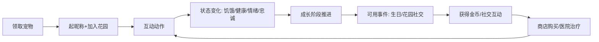
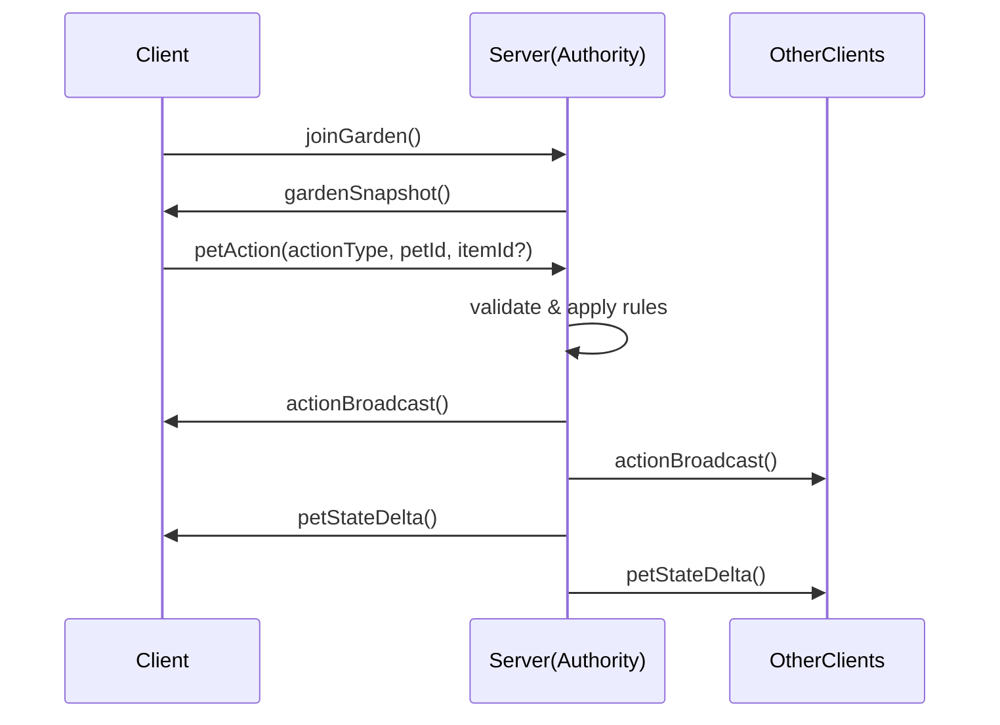

## 项目名称

小屋里的电子宠物

## 项目代号

cute_cat

## 一句话愿景

把每个玩家的“电子宠物”变成一个有成长、情绪与记忆的像素世界角色，并在同一花园里让玩家用简单交互形成真实的陪伴感与社交感。

## 核心概念（名词约定）

1. `Pet` 宠物：猫/狗/小鸡/小鸭/小兔子/小猪（可扩展），具有外观、性格、成长阶段、状态（饥饿/健康/情绪/忠诚）与终身记忆。
2. `User` 用户：一个账号在游戏中只拥有 1 只宠物（本 MVP 固定为 1，只用于保持实现边界清晰；后续再扩展多宠物）。
3. `Garden` 花园乐园：最多容纳 10 个用户/宠物的同屏场景。用户通过鼠标位置“出现”在花园里，并可对附近宠物执行互动。
4. `GameDay` 游戏天：现实 12 小时 = 1 个游戏天；等价于 `现实 1 小时 = 游戏 2 小时`，因此 `GameDay` 内包含 `24` 游戏小时。开服时间对应 `Year 1 Day 1`。
5. `Event` 事件：生日庆祝或花园社交活动；由服务器调度，在指定游戏日期/时间点开启。
6. `AI`：只负责可控的“文本/建议/叙事”，不可直接控制经济与数值规则（避免失控）。

## 产品范围与 MVP 边界（明确先做什么/不做什么）

### MVP（多人同花园优先，先闭环可玩）

1. 复古像素风：宠物、道具、花园 UI 都采用像素化资源（由前端/设计提供通用素材包）。
2. 领取宠物：每个用户首次登录领取 1 只宠物（随机类型与外观种子），并为其起昵称。
3. 加入花园：用户进入某个花园（`Garden`），花园最多 10 人；展示其他用户的“鼠标位置投影”。
4. 基础互动：在同一花园内对自家宠物执行交互，并可感知他人互动带来的动画/状态变化（先弱化“复杂社交关系”）。
5. 状态与成长：宠物会随游戏时间推移而变化（饥饿、健康、情绪等），互动会影响状态并推动成长阶段变化。
6. 基础经济循环：金币余额 + 商店（粮/玩具/小窝/饭盒）+ 医院治疗（付费恢复）。
7. 事件模板：至少支持两类事件（生日庆祝 + 花园社交活动），但规则由模板驱动，AI 只输出文案/对话与建议玩法。

### 非目标（MVP 暂不实现或弱化）

1. 深度自由交易市场：MVP 先不做完整交易撮合；可先提供“赠与/投喂”简化接口（或先不做）。
2. 完整的多样社交关系系统：先不做复杂好友/消息/动态；社交主要来自同屏互动与活动协作奖励。
3. AI 生成的“数值规则”：所有会影响经济与伤病概率的数值，均来自模板/规则配置。
4. 大规模多宠物：本 MVP 固定为 1 个用户 1 只宠物（后续再扩展多宠物/多窝）。

## 用户体验流程（从 0 到可玩）

1. 首次登录
  - 系统分配宠物类型 + 外观种子
  - 用户输入宠物昵称
  - 引导加入花园（如果花园未满则加入；满则分配其他花园）
2. 花园内
  - 鼠标移动：在花园内显示用户投影位置
  - 点击交互：选择对宠物的动作（喂食/抱抱/摸脑袋/玩玩具/就医）
3. 宠物变化
  - 服务器接收动作并更新宠物状态
  - 客户端播放动画并展示状态条变化
4. 长期体验
  - 系统在每个 `Pet` 的生日游戏日期触发生日事件
  - 花园定期触发社交事件，推动玩家互动与金币获取

## 玩家体验闭环（为什么“想回来”）

从第一性原理拆解，玩家需要同时获得三种体验：短周期的“好玩”，长期稳定的“情感寄托”，以及低成本的“社交陪伴”。为避免成为“看着会动但没有目标”，MVP 需要把这些体验都落到可见机制上。

1. 可理解目标（30 秒内知道该做什么）
  - 每次进入花园都展示 `Pet` 当前的 3 个直观需求条：`hunger` / `health` / `mood`（或其等价 UI 呈现）
  - 展示“下一步建议动作”，由服务器根据状态与事件阶段给出（例如更适合喂食还是抱抱）
  - 给出危险提示（例如“健康偏低/可能要生病”）并明确行动窗口（例如“在本 `GameDay` 前喂食可显著降低风险”）
2. 强反馈差异（同一个动作，在不同状态下有明显不同）
  - 动画反馈必须和状态变化同步：喂食时出现进食动画并立刻影响 `hunger/health`，抱抱/摸头立刻影响 `mood/loyalty`
  - 互动收益要与状态挂钩：例如 `sick` 或 `hunger` 很高时，部分动作收益降低或触发“不适反应”（由模板/规则配置）
  - 成长阶段变化必须可见：达到阈值后宠物外观/技能（或交互效果）解锁至少 1 项明显差异
3. 离线连续性（退出后时间不断，但回来必须看得懂）
  - 游戏时间由连续游戏时钟推进，离线也会发生状态变化（不会暂停）
  - 玩家回到花园时展示“离线摘要”：最近一段离线窗口里最主要的 1-2 个变化原因（例如“因为久未进食出现轻微生病趋势”）
  - 离线摘要后立刻给出“当前最需要的补救动作”，让玩家无需猜测就能进入下一轮循环
4. 社交陪伴的协作动机（让多人同屏不只是观看）
  - 花园社交事件的 `taskList` 至少包含 1 个“协作轻任务”（例如达到累计互动次数/投喂累计/小游戏得分累计）
  - 奖励分为两层：个人完成奖励 + 花园协作奖励（确保即使只做一点也能参与到“共同成果”）
  - 让他人互动可感知：当别人完成任务时，玩家能在花园内看到进度条/装饰进度/庆祝动画，从而形成回访理由
5. 记忆触发点（把“终身记忆”变成可被调用的情感资产）
  - 生日当天必须引用记忆片段（至少 1 条来自本宠物 `memory.milestones`）
  - 生病治疗完成后触发“康复一句话/对话气泡”（写入里程碑并在后续互动中复用）
  - 关键互动里程碑写入 `memory.milestones`，并在未来事件里作为台词或建议的上下文（AI 只负责叙事与建议，不改数值规则）

## 核心循环（游戏回路）




## 验证与迭代（上线时如何判断是否真的“好玩且有寄托”）

上线前建议先用小规模可玩原型验证，再用线上指标确认。

1. 原型验证（功能切片）
  - 目标：1 个花园 + 2 个用户 + 1 只宠物，验证“30 秒可理解目标”“每次互动有明显反馈”“退出回来的离线摘要能指导下一步”
  - 观测：玩家首次互动用时、是否能说出“我现在该做什么最有效”、以及是否愿意立即再来一次互动
2. 上线指标（可量化）
  - 留存：`D1/D7/D30`
  - 会话：平均单次时长、会话频率（是否形成稳定回访节奏）
  - 循环参与：喂食/抱抱/摸头的动作触发率、成功率与失败/不适反应占比
  - 社交事件：事件参与率、花园协作任务完成度、事件期间的活跃度提升幅度
  - 离线连续性理解：回归后 1 分钟内的“下一步动作选择正确率”（由服务器的建议与玩家实际动作对齐度来近似）

## 宠物成长与状态机（文字版状态机 + 关键数值维度）

### 关键状态字段（建议 MVP 至少这些）

1. `hunger` 饥饿值：0~100（越高越饿）
2. `health` 健康值：0~100（越低越容易生病/死亡等；MVP 可先用“生病状态”）
3. `mood` 情绪值：-100~100（影响互动收益：抱抱/摸脑袋对忠诚的加成等）
4. `loyalty` 忠诚/好感：0~100（影响愿意参与互动与事件表现）
5. `ageDays` 宠物游戏年龄（以 `GameDay` 计）
6. `growthStage` 成长阶段（如：幼年/成长/成熟；阶段阈值可配置）
7. `personality` 性格向量（MVP 可用少量离散维度，如 `playful/foodie/cuddly`）
8. `memory` 终身记忆摘要（AI 输出的叙事与里程碑列表，受控存储）

### 时间推进规则（MVP 建议）

1. 服务器使用“连续游戏时钟”推进游戏时间：游戏世界不因玩家退出而暂停
  - 服务器基于墙钟时间换算得到当前游戏时间（避免只在有人在线时才推进）
  - 现实 12 小时推进 1 `GameDay`（见上面的换算定义）
2. 定时 tick 只负责“在游戏时间到达边界时结算”（例如每个 `GameDay`）
3. 每次 `GameDay`：
  - `hunger` 递增：例如 `+X(取决于食物偏好、最近进食、活动强度)`
  - `health` 变化：取决于 `hunger` 与 `sickness`（若饥饿高则健康下降）
  - `mood` 变化：取决于 `互动频率` 与 `健康`
  - 检查是否触发 `sick`（生病）状态

### 生病与情绪（可执行、可平衡）

1. `sick` 状态（布尔或强度）
  - 触发条件（模板驱动的概率/阈值）：
    - 饥饿超过阈值
    - “饮食骤变”（例如最近连续使用同一种食物后突然换一种，触发疾病概率）
2. 治疗
  - 医院治疗需要付费金币（费用与治疗档位由模板配置）
  - 治疗会：
    - 降低 `sick` 强度
    - 恢复 `health`，同时重置部分负面情绪

### Pet 状态机（示意）

```mermaid
flowchart TD
  Healthy[健康(无病)] --> Sick[生病]
  Sick --> Treating[治疗中(短暂动画)]
  Treating --> Healthy
  Healthy --> Starving[极度饥饿(子状态)]
  Starving --> Sick
```


### 成长阶段推进规则（MVP，情绪稳定优先）

> 目标：让玩家理解并通过策略“把宠物养稳”，而不是只靠短期喂食堆数值。

1. 统计窗口（每次结算都会更新）
  - 滑动窗口：最近 `N = 4` 个 `GameDay`
  - 统计项：
    - `health_avg`：窗口内健康均值（或健康离散档的均值）
    - `mood_avg`：窗口内情绪均值（或情绪离散档的均值）
  - `sick_count`：窗口内是否出现过 `sick`（MVP 简化为 0/1：出现过则为 1，不重复计数）
2. 无生病底线（硬约束）
  - 要求 `sick_count == 0` 才允许本窗口积累“成长稳定度”
3. 情绪稳定优先（可解释判定）
  - 离散稳定档（示意，便于实现与调参）：
    - `healthStable`：`health_avg >= 55` 则为 1，否则为 0
    - `moodStable`：`mood_avg >= 30` 则为 1，否则为 0
  - 稳定度分数：
    - `stabilityScore = 0.4 * healthStable + 0.6 * moodStable`
  - 若 `sick_count >= 1`
    - 直接将本窗口 `stabilityScore` 降到较低水平（例如 < 0.3），并清空“连续满足计数”（强制玩家重新积累稳定期）
4. 升级与回退（让成长有确定性）
  - 升级：当 `stabilityScore` 达到“满足条件”的档位，并连续满足 `K = 2` 次 `GameDay` 结算，即进入下一 `growthStage`
  - 回退：一旦在任意窗口结算中发现 `sick_count >= 1`，清空连续满足计数（避免“边生病边升级”）
5. UI 展示要求（必须可读）
  - 成长面板展示：
    - 当前 `growthStage`
    - `stabilityScore` 对应的稳定度档（或 0~100 分数）
    - “距离下一阶段还差什么”（最多 1~2 条缺口），缺口优先级固定为：
      1. `无生病底线` 是否满足（若不满足，优先显示“可能已接近/已触发生病窗口：下一次 GameDay 前完成 Feed 或就医”）
      2. `mood` 稳定性是否达标（提示优先抱抱/摸头等互动）

## 互动玩法细化（MVP 动作集合）

### 交互输入与输出

1. 输入：客户端点击/选择动作（动作类型 + 目标宠物 id + 可选物品 id）
2. 输出：
  - 服务器校验（是否在花园内、是否允许该动作、道具是否足够、距离/范围限制）
  - 更新宠物状态并生成“动作事件”（用于动画）
  - 广播到同一花园所有客户端（至少广播关键状态变化与动作动画）

### MVP 动作列表（建议）

1. `Feed`
  - 使用 `Food`（粮）对宠物喂食
  - 效果由“食物营养/好吃度 + 宠物偏好概率 + 饥饿阈值”共同决定
  - 若饮食骤变且不匹配，则提升生病概率
2. `Cuddle` / `Hug`
  - 抱抱：提升 `mood` 与 `loyalty`
  - 若宠物很饿/生病，则抱抱收益降低或触发不适反应（由模板配置）
3. `Pat`（摸头；与前端/后端协议枚举一致，见 [API-后端与前端对接.md](API-后端与前端对接.md)）
  - 摸脑袋：轻量提升 `mood/loyalty`，更适合频繁互动
4. `Play`
  - 玩玩具：提升 `mood/忠诚`（从而帮助提高“情绪稳定度”；成长阶段推进仍以稳定度结算为准，避免绕过成长规则）
5. `TreatAtHospital`
  - 就医：使用金币恢复健康

## 经济系统（金币、商店、医院、概率偏好）

### 资源类型

1. `Coins`：游戏币（用于购买与治疗）
2. `Food / Toy / Bed / Bowl`：道具
3. `MedicalService`：治疗服务（不同档位）

### 商店与道具属性（模板配置驱动）

每个道具至少包含：

1. `price` 价格（金币）
2. `nutrition` 营养贡献（影响健康提升与饥饿降低量）
3. `taste` 好吃度贡献（影响宠物当次“吃了是否开心”与忠诚增益）
4. `compatiblePetTypes` 宠物类型匹配（如猫偏好/需求）
5. `sicknessRisk` 生病风险系数（可为 0~1）
6. `variantTag`（可选）用于“饮食骤变”判断（例如只看 foodId 或 category）

### “喜好概率”与“骤变生病”规则（可落地）

1. 每只宠物具有基础偏好（由性格向量+AI 记忆摘要生成的“建议偏好”落地为参数）
2. 当喂食某一食物：
  - 匹配概率 `p = sigmoid(宠物偏好 - 食物标签距离)`（或简化离散映射）
  - 若匹配成功：好吃度与情绪收益更高，生病风险更低
  - 若匹配失败：好吃度较低，且若最近连续食用同类后突然切换，则疾病概率上升

### 获取金币（MVP 先保证“可玩性”）

1. 与宠物互动：完成一定互动次数可获得少量金币（由花园模板触发或按天结算）
2. 参与事件：生日庆祝与花园社交活动参与可获奖励
3. 简化交易（可选）：MVP 不强制实现交易系统；若要做，可从“赠与/投喂”开始，避免复杂撮合。

## 事件系统：生日与花园社交活动（模板机制 + AI 辅助）

### 事件触发

1. `BirthdayEvent`
  - 触发条件：宠物领取那天为生日；按游戏日期计算
  - 在宠物生日游戏天启动庆祝活动
  - 持续时间：生日庆祝固定持续 `24` 游戏小时（即 1 个 `GameDay`）
  - **实现口径（周期 3 钉死）**：服务器使用单调递增的一维 `gameDayIndex`。领宠时将 `birthday_game_day` 记为当前 `gameDayIndex`。**周年当日**定义为满足：`game_day_index >= birthday_game_day` 且 `(game_day_index - birthday_game_day) % 365 == 0`（**`365` 为 1 个游戏年的游戏日数**，常量名建议 `YEAR_GAME_DAYS`）。在该 `game_day_index` 所覆盖的整个 `GameDay` 内活动有效。细则与任务拆分见 `doc/周期3-任务拆分.md` §1.2。
2. `GardenSocialEvent`
  - 触发频率：每 1-2 周一次；间隔不固定，随具体活动类型/策略而变化（由服务器策略配置）
  - 会提前通告并在时间点开启
  - **MVP 实现占位**：联调阶段可采用确定性公式按花园轮转窗口（`SOCIAL_PERIOD_GAME_DAYS = 10`、连续 `SOCIAL_SPAN_GAME_DAYS = 2` 等），与文档级「不规则间隔」并存迭代；以 `doc/周期3-任务拆分.md` §1.3 为准。

### 事件模板（MVP 关键：规则不可由 AI 任意生成）

为每类事件定义 `EventTemplate`：

1. `templateId`
2. `trigger`（生日/周期）
3. `duration` 持续游戏时间（例如：生日固定 24 游戏小时；花园社交 12-48 小时，按活动模板配置）
4. `participantsLimit`（可参与人数/参与上限）
5. `taskList`（任务清单：如签到、投喂挑战、小游戏）
6. `rewardTable` 奖励规则（参与者金币、宠物忠诚提升、活动专属道具等）
7. `requiredAssets` 素材清单（UI/背景/气泡/动画帧引用）

### AI 在事件中的角色（受控输出）

AI 输出仅允许落在以下字段：

1. 文案：活动标题、公告、对话气泡、提示语
2. 互动引导建议：例如“宠物更可能喜欢哪类任务表现”
3. 记忆片段：将事件作为里程碑写入宠物终身记忆摘要

AI 不负责：

1. 任何经济数值（金币数量、治疗费用、商店价格）
2. 任何概率的核心参数（生病概率、失败概率的公式系数）
3. 宠物状态更新的最终数值（只能返回“叙事/建议”，由模板落地为可控参数）

## 多人同花园 MVP：实时同步与服务器权威

### 网络目标（MVP）

1. 同一花园内多用户同时存在
2. 他人鼠标投影位置可见（简化为坐标更新）
3. 互动动作可见（动画/粒子/状态变化）
4. 宠物状态在服务器上权威更新，客户端仅展示

### 消息类型（建议）

1. `ClientToServer`
  - `joinGarden`：进入花园、拉取初始状态
  - `updatePointer`：鼠标投影坐标（节流，例如每 100ms 一次）
  - `petAction`：喂食/抱抱/摸头/玩耍/就医（携带动作参数）
2. `ServerToClient`
  - `gardenSnapshot`：进入时的初始状态（宠物与用户基础信息）；**周期 3 起含 `activeEvents`（SSOT），详见 `doc/API-后端与前端对接.md`**
  - `pointerUpdate`：他人指针坐标变化
  - `actionBroadcast`：他人动作导致的动画事件
  - `petStateDelta`：宠物状态变化的增量（用于更新 UI）
  - `eventBroadcast`：事件开始/结束与任务提示

### Mermaid 时序图（同花园动作流）




## 数据模型草案（字段粒度清晰，便于实现）

> 说明：此处不绑定具体数据库技术；用“字段清单 + 规则责任划分”帮助实现。

### `User`

1. `userId`：唯一标识
2. `nickname`：用户在站内昵称
3. `createdAt`：创建时间
4. `gardenId`：当前花园
5. `coins`：金币余额
6. `pointer`：仅用于展示的临时状态（不建议强一致保存）

### `Garden`

1. `gardenId`：唯一标识
2. `capacity`：默认 10
3. `petIds`：该花园当前宠物列表（最多 10）
4. `layoutVersion`：布局版本（用于坐标映射/渲染）
5. `createdAt`

### `Pet`

1. `petId`
2. `ownerUserId`
3. `petType`：cat/dog/chick/duck/rabbit/pig
4. `skinSeed`：外观随机种子（用于前端渲染）
5. `petName`：昵称
6. `birthdayGameDay`：生日所在游戏日期（用于触发）
7. `ageDays`
8. `growthStage`
9. `personality`：性格参数（离散/向量都可以）
10. `stats`
  - `hunger`
    - `health`
    - `mood`
    - `loyalty`
    - `sickLevel`（可为 0~N）
11. `dietHistory`：最近 N 次进食记录（用于饮食骤变判断；MVP 可只存 `foodId`/`category` + 时间）
12. `memory`
  - `summary`：终身记忆摘要（AI 生成，受控）
    - `milestones`：里程碑列表（生日/重大互动/生病治疗）
    - `lastUpdatedAt`

### `Inventory`（道具背包）

1. `userId`
2. `foodItems[]`：每个食物的数量
3. `toyItems[]`
4. `bedItems[]`
5. `bowlItems[]`

### `ShopConfig`（商店配置）

1. `foodCatalog[]`：foodId -> 属性（price/nutrition/taste/sicknessRisk/compatiblePetTypes/variantTag）
2. `toyCatalog[]`
3. `bedCatalog[]`
4. `bowlCatalog[]`

### `HospitalServiceConfig`

1. `serviceId`
2. `price`
3. `healAmount`
4. `sickReduction`

### `Event`

1. `eventId`
2. `eventType`：birthday/social
3. `gardenId` 或 `petId`（生日是 pet 维度更合理；社交是 garden 维度）
4. `startGameDayTime` / `endGameDayTime`
5. `templateId`
6. `state`：scheduled/active/ended
7. `participants`：参与者与完成进度（MVP 简化即可）

## AI 与终身记忆：最小安全边界（MVP 可落地）

### MVP AI 输入

1. 宠物基础参数：`petType/personality/当前stats/最近dietHistory/当前growthStage`
2. 事件上下文：正在发生的 `Event` 类型 + 参与者行为
3. 里程碑触发：生日当天、治疗完成、重大互动（例如连续 5 次喂食成功）

### MVP AI 输出字段（受控）

1. `memory.summary`：终身记忆摘要（文本）
2. `memory.milestones[]`：里程碑文本（时间戳 + 事件片段）
3. `eventText`：活动公告、任务说明、对话气泡
4. `narrativeSuggestions`：不直接改数值的建议（例如“它最近更喜欢安静的游戏”）

### AI 更新频率与容量（避免无限膨胀）

1. `memory.summary`：每周最多更新一次（或每当触发里程碑累计达到 N 次更新）
2. `milestones`：最多保留最近 M 条（旧的合并进 summary）
3. 生成失败兜底：AI 失败时使用模板默认文案，保证游戏可玩。

## 素材与前端资产要求（通用打包思路）

为降低成本，事件需要提前准备通用素材包：

1. 通用花园背景与 UI 容器（事件弹窗/任务面板/气泡样式）
2. 统一动画帧格式（喂食、抱抱、摸头、玩耍、治疗）
3. 事件宣传背景（可用通用背景 + 文案替换）
4. 生日专属装饰（蛋糕/彩带/小灯等，按像素风格统一）

## 开发建议的实施顺序（不写代码版）

1. 先把“多人同花园状态同步 + petAction 校验 + 状态条展示”打通
2. 再加上“时间 tick 与状态变化曲线”
3. 接着补齐“商店道具、喂食概率与医院治疗”
4. 最后引入“事件模板 + AI 文案/记忆里程碑（不碰数值）”

## 未决事项 / 待实现细化清单

本节用于记录**尚未在实现层钉死**、但容易在口头沟通中丢失的约定。进入对应开发周期前，应将条目**收敛为配置、协议或测试用例**，并同步更新本文档或专题设计附录。

### 1. 商店与道具配置（周期 2 前建议定稿）

1. `ShopConfig` 各目录条目的**最终字段集合**（除已列 `price/nutrition/taste/...` 外）：
  - 是否需 `itemId` 全局唯一规则、版本号、下架策略
  - `variantTag` 与 `dietHistory` 骤变判定的**精确规则**（按 `foodId` 还是按 `category`）
2. 背包与堆叠：`Inventory` 中单类道具**最大堆叠**、是否允许多槽位
3. 购买流程：纯 HTTP 还是 WebSocket 内消息；失败码与前端提示文案

### 2. 事件模板与调度（周期 3 前建议定稿）

1. `EventTemplate` 的**机器可读配置格式**（JSON/YAML）及校验方式，例如字段：
  - `templateId`、`eventType`、`durationGameHours`、`taskList[]`、`rewardTable`、`requiredAssets[]`
2. **调度策略**：花园社交事件「每 1-2 周一次、不固定」在服务器上的**具体算法**（随机窗口、种子、是否全服统一）
3. `eventBroadcast` 的**消息体字段表**（与客户端订阅一一对应）
4. 示例（占位，实现时以最终 schema 为准）：

```json
{
  "templateId": "garden_social_v1",
  "eventType": "social",
  "durationGameHours": 24,
  "taskList": [
    { "taskId": "feed_total", "type": "accumulate", "target": 10, "scope": "garden" }
  ],
  "rewardTable": {
    "personal": { "coins": 50 },
    "garden": { "coins": 100, "decorationProgress": 1 }
  }
}
```

### 3. 协议与鉴权（周期 0～1 前建议定稿）

1. WebSocket / HTTP 的**鉴权方式**（Token、Cookie、短期票据）与断线重连
2. 每条消息的 **Pydantic / TypeScript 类型定义**存放位置（`shared/` 或代码生成策略）
3. `requestId`、错误码、限流与恶意 `updatePointer` 的节流参数

### 4. LangChain 与 AI（周期 4 前建议定稿）

1. 模型提供方、调用超时、重试、**成本上限**（按日/按用户）
2. 输出 JSON Schema 与**服务端校验**（禁止数值注入）
3. 密钥与环境变量命名（仅写在部署文档与 `.env.example`，不写进业务文档正文）

### 5. 测试用例优先级（建议测试组维护为独立表，此处为优先级指引）


| 优先级 | 范围                                           | 说明        |
| --- | -------------------------------------------- | --------- |
| P0  | 时间换算、离线回算、`petAction` 校验、`petStateDelta` 一致性 | 影响公平与存档   |
| P1  | 同花园广播、指针节流、双客户端可见性                           | 影响多人体验    |
| P2  | 商店购买、医院扣费、`sick` 与成长稳定度                      | 影响经济与生成长线 |
| P3  | 事件任务进度、奖励结算、`eventBroadcast`                 | 周期 3      |
| P4  | AI 文案与记忆写入、降级路径                              | 周期 4      |


### 6. 运维与数据（周期 5 或上线前）

1. MySQL 备份与恢复策略；若需迁至 PostgreSQL 的**切换条件**（与 [后端开发设计文档.md](后端开发设计文档.md) 一致）
2. 日志字段规范（请求 id、用户 id、花园 id、消息类型）
3. 健康检查与 WebSocket 连接数监控

### 7. 本清单维护方式

1. 讨论结论落地后：**删除或改写对应条目**，避免长期停留在「未决」
2. 若某块内容过长，可拆出独立文档（如 `doc/事件模板配置说明.md`），并在本节保留**链接与一行摘要**

